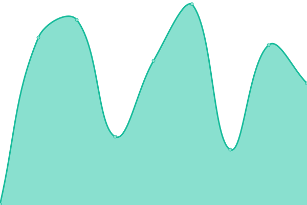
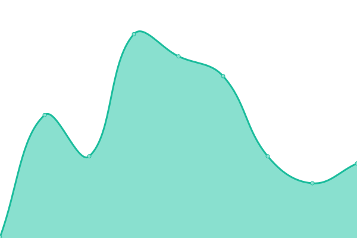
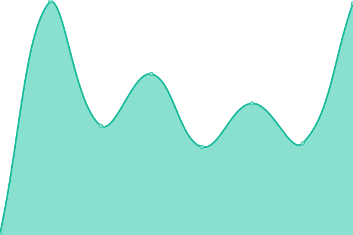

# [📈 Live Status](https://status.johng.io): <!--live status--> **🟧 Partial outage**

This repository contains the open-source uptime monitor and status page for [John Goodliff](johng.io), powered by [Upptime](https://github.com/upptime/upptime).

With [Upptime](https://upptime.js.org), you can get your own unlimited and free uptime monitor and status page, powered entirely by a GitHub repository. We use [Issues](https://github.com/jerboa88/status/issues) as incident reports, [Actions](https://github.com/jerboa88/status/actions) as uptime monitors, and [Pages](https://status.johng.io) for the status page.

<!--start: status pages-->
<!-- This summary is generated by Upptime (https://github.com/upptime/upptime) -->
<!-- Do not edit this manually, your changes will be overwritten -->
<!-- prettier-ignore -->
| URL | Status | History | Response Time | Uptime |
| --- | ------ | ------- | ------------- | ------ |
|  [168421 (168421.xyz)](https://168421.xyz) | 🟩 Up | [168421-168421-xyz.yml](https://github.com/twocaretcat/status/commits/HEAD/history/168421-168421-xyz.yml) | 

 210ms
     
 | 

<a href="https://status.johng.io/history/168421-168421-xyz">100.00%</a>
    

|  [Astro Snapshot (astro-snapshot.johng.io)](https://astro-snapshot.johng.io) | 🟩 Up | [astro-snapshot-astro-snapshot-johng-io.yml](https://github.com/twocaretcat/status/commits/HEAD/history/astro-snapshot-astro-snapshot-johng-io.yml) | 

 150ms
     
 | 

<a href="https://status.johng.io/history/astro-snapshot-astro-snapshot-johng-io">100.00%</a>
    

|  [Caret Labs (caretlabs.co)](https://caretlabs.co) | 🟩 Up | [caret-labs-caretlabs-co.yml](https://github.com/twocaretcat/status/commits/HEAD/history/caret-labs-caretlabs-co.yml) | 

 57ms
     
 | 

<a href="https://status.johng.io/history/caret-labs-caretlabs-co">100.00%</a>
    

|  [Game Maps (game-maps.johng.io)](https://game-maps.johng.io) | 🟥 Down | [game-maps-game-maps-johng-io.yml](https://github.com/twocaretcat/status/commits/HEAD/history/game-maps-game-maps-johng-io.yml) | 

 85ms
     
 | 

<a href="https://status.johng.io/history/game-maps-game-maps-johng-io">28.97%</a>
    

|  [Komodo - Mods for Komoot (komodo.johng.io)](https://komodo.johng.io) | 🟩 Up | [komodo-mods-for-komoot-komodo-johng-io.yml](https://github.com/twocaretcat/status/commits/HEAD/history/komodo-mods-for-komoot-komodo-johng-io.yml) | 

 189ms
     
 | 

<a href="https://status.johng.io/history/komodo-mods-for-komoot-komodo-johng-io">100.00%</a>
    

|  [Mergist - Online PDF Merger (mergist.johng.io)](https://mergist.johng.io) | 🟥 Down | [mergist-online-pdf-merger-mergist-johng-io.yml](https://github.com/twocaretcat/status/commits/HEAD/history/mergist-online-pdf-merger-mergist-johng-io.yml) | 

 105ms
     
 | 

<a href="https://status.johng.io/history/mergist-online-pdf-merger-mergist-johng-io">28.39%</a>
    

|  [Portfolio (johng.io)](https://johng.io) | 🟩 Up | [portfolio-johng-io.yml](https://github.com/twocaretcat/status/commits/HEAD/history/portfolio-johng-io.yml) | 

 219ms
     
 | 

<a href="https://status.johng.io/history/portfolio-johng-io">100.00%</a>
    

|  [Short End - URL Shortener (l.johng.io)](https://l.johng.io) | 🟥 Down | [short-end-url-shortener-l-johng-io.yml](https://github.com/twocaretcat/status/commits/HEAD/history/short-end-url-shortener-l-johng-io.yml) | 

 98ms
     
 | 

<a href="https://status.johng.io/history/short-end-url-shortener-l-johng-io">28.39%</a>
    

|  [Tally - Word Counter (tally.johng.io)](https://tally.johng.io) | 🟩 Up | [tally-word-counter-tally-johng-io.yml](https://github.com/twocaretcat/status/commits/HEAD/history/tally-word-counter-tally-johng-io.yml) | 

 138ms
     
 | 

<a href="https://status.johng.io/history/tally-word-counter-tally-johng-io">100.00%</a>
    

|  [TrueCharts Domain Calculator (truecharts-domain-calc.johng.io)](https://truecharts-domain-calc.johng.io) | 🟩 Up | [true-charts-domain-calculator-truecharts-domain-calc-johng-io.yml](https://github.com/twocaretcat/status/commits/HEAD/history/true-charts-domain-calculator-truecharts-domain-calc-johng-io.yml) | 

 159ms
     
 | 

<a href="https://status.johng.io/history/true-charts-domain-calculator-truecharts-domain-calc-johng-io">100.00%</a>
    

<!--end: status pages-->

[**Visit our status website →**](https://status.johng.io)

## 📄 License

- Powered by: [Upptime](https://github.com/upptime/upptime)
- Code: [MIT](./LICENSE) © [Anand Chowdhary](https://anandchowdhary.com), supported by [Pabio](https://pabio.com)
- Data in the `./history` directory: [Open Database License](https://opendatacommons.org/licenses/odbl/1-0/)
